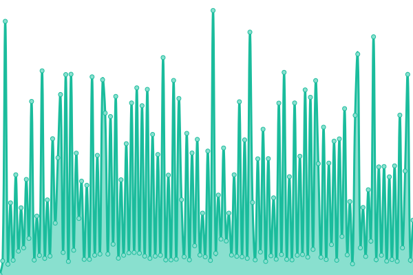

# [📈 Live Status](https://demo.upptime.js.org): <!--live status--> **🟧 Partial outage**

This repository contains the open-source uptime monitor and status page for [E1security](https://demo.upptime.js.org), powered by [Upptime](https://github.com/upptime/upptime).

With [Upptime](https://upptime.js.org), you can get your own unlimited and free uptime monitor and status page, powered entirely by a GitHub repository. We use [Issues](https://github.com/E1security/upptime/issues) as incident reports, [Actions](https://github.com/E1security/upptime/actions) as uptime monitors, and [Pages](https://demo.upptime.js.org) for the status page.

<!--start: status pages-->
<!-- This summary is generated by Upptime (https://github.com/upptime/upptime) -->
<!-- Do not edit this manually, your changes will be overwritten -->
<!-- prettier-ignore -->
| URL | Status | History | Response Time | Uptime |
| --- | ------ | ------- | ------------- | ------ |
|  [VPN](https://vpn.e1.co.kr) | 🟩 Up | [vpn.yml](https://github.com/E1security/upptime/commits/HEAD/history/vpn.yml) | 

 987ms
     
 | 

<a href="https://E1security.github.io/upptime/history/vpn">100.00%</a>
    

|  [SGVPN](https://sgvpn.e1.co.kr) | 🟩 Up | [sgvpn.yml](https://github.com/E1security/upptime/commits/HEAD/history/sgvpn.yml) | 

 1102ms
     
 | 

<a href="https://E1security.github.io/upptime/history/sgvpn">100.00%</a>
    

|  [OTP](https://otp.e1.co.kr:9443) | 🟩 Up | [otp.yml](https://github.com/E1security/upptime/commits/HEAD/history/otp.yml) | 

 1150ms
     
 | 

<a href="https://E1security.github.io/upptime/history/otp">100.00%</a>
    

|  [VDI](https://vdi.e1.co.kr) | 🟩 Up | [vdi.yml](https://github.com/E1security/upptime/commits/HEAD/history/vdi.yml) | 

 1765ms
     
 | 

<a href="https://E1security.github.io/upptime/history/vdi">100.00%</a>
    

|  [E1](https://www.e1.co.kr) | 🟩 Up | [e1.yml](https://github.com/E1security/upptime/commits/HEAD/history/e1.yml) | 

 2803ms
     
 | 

<a href="https://E1security.github.io/upptime/history/e1">100.00%</a>
    

|  [E1orangecard](https://www.e1orangecard.com) | 🟥 Down | [e1orangecard.yml](https://github.com/E1security/upptime/commits/HEAD/history/e1orangecard.yml) | 

 0ms
     
 | 

<a href="https://E1security.github.io/upptime/history/e1orangecard">0.03%</a>
    

|  [E1ecos](https://www.e1ecos.co.kr) | 🟥 Down | [e1ecos.yml](https://github.com/E1security/upptime/commits/HEAD/history/e1ecos.yml) | 

 0ms
     
 | 

<a href="https://E1security.github.io/upptime/history/e1ecos">0.03%</a>
    

|  [E1careers](https://www.e1careers.com) | 🟩 Up | [e1careers.yml](https://github.com/E1security/upptime/commits/HEAD/history/e1careers.yml) | 

 3172ms
     
 | 

<a href="https://E1security.github.io/upptime/history/e1careers">100.00%</a>
    

|  [E-Accounting](https://e-accmobile.e1.co.kr) | 🟥 Down | [e-accounting.yml](https://github.com/E1security/upptime/commits/HEAD/history/e-accounting.yml) | 

 0ms
     
 | 

<a href="https://E1security.github.io/upptime/history/e-accounting">0.03%</a>
    

|  [SHE](https://m-she.e1.co.kr) | 🟥 Down | [she.yml](https://github.com/E1security/upptime/commits/HEAD/history/she.yml) | 

 0ms
     
 | 

<a href="https://E1security.github.io/upptime/history/she">0.03%</a>
    

|  [partner-SHE](https://partner-she.e1.co.kr) | 🟥 Down | [partner-she.yml](https://github.com/E1security/upptime/commits/HEAD/history/partner-she.yml) | 

 0ms
     
 | 

<a href="https://E1security.github.io/upptime/history/partner-she">0.03%</a>
    

|  [e1mobile](http://www.e1mobile.co.kr:30021) | 🟥 Down | [e1mobile.yml](https://github.com/E1security/upptime/commits/HEAD/history/e1mobile.yml) | 

 0ms
     
 | 

<a href="https://E1security.github.io/upptime/history/e1mobile">0.03%</a>
    

|  [autodiscover.lsworkplace.onmicrosoft.com](http://autodiscover.lsworkplace.onmicrosoft.com) | 🟩 Up | [autodiscover-lsworkplace-onmicrosoft-com.yml](https://github.com/E1security/upptime/commits/HEAD/history/autodiscover-lsworkplace-onmicrosoft-com.yml) | 

 1573ms
     
 | 

<a href="https://E1security.github.io/upptime/history/autodiscover-lsworkplace-onmicrosoft-com">100.00%</a>
    

|  [samlsso.lsworkplace.com](https://samlsso.lsworkplace.com:8443/login/jsp/login/ext/signonext/?returnURL) | 🟩 Up | [samlsso-lsworkplace-com.yml](https://github.com/E1security/upptime/commits/HEAD/history/samlsso-lsworkplace-com.yml) | 

 2584ms
     
 | 

<a href="https://E1security.github.io/upptime/history/samlsso-lsworkplace-com">100.00%</a>
    

<!--end: status pages-->

[**Visit our status website →**](https://demo.upptime.js.org)

## 📄 License

- Powered by: [Upptime](https://github.com/upptime/upptime)
- Code: [MIT](./LICENSE) © [E1security](https://demo.upptime.js.org)
- Data in the `./history` directory: [Open Database License](https://opendatacommons.org/licenses/odbl/1-0/)
